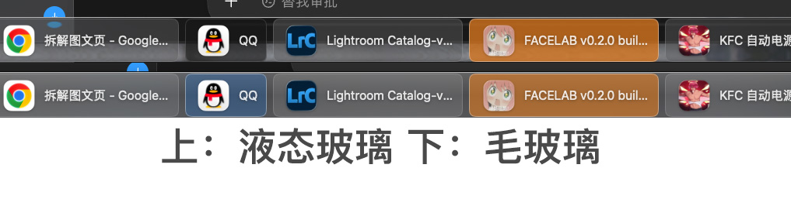
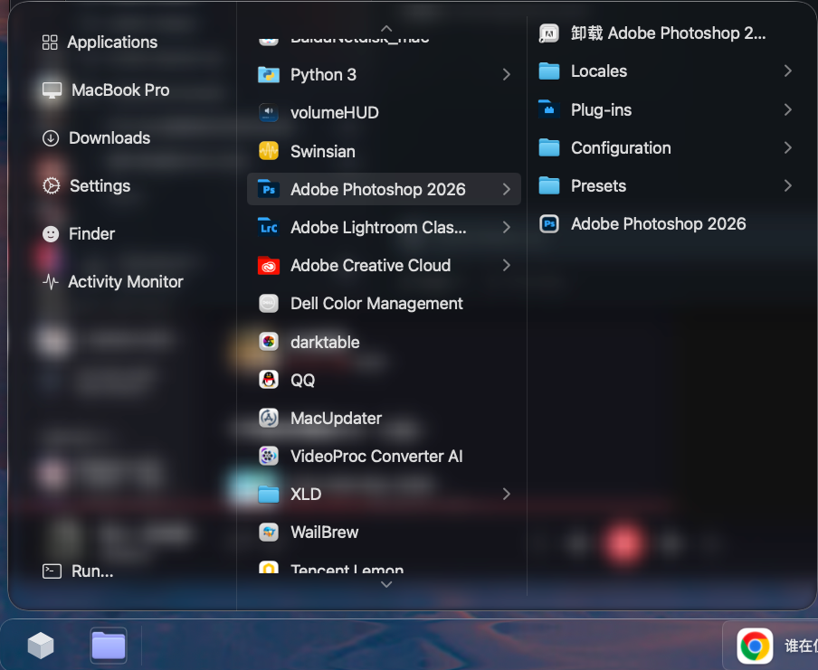
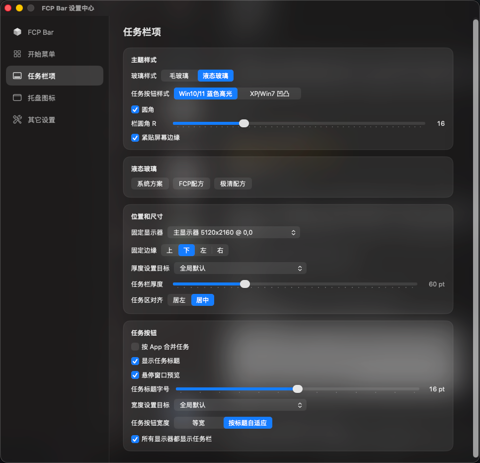
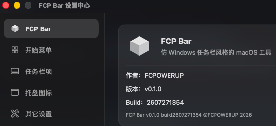

# FCP Bar

macOS 原生任务栏替代方案：兼顾 Windows 任务栏效率、经典开始菜单，以及现代毛玻璃 / 液态玻璃界面；随时可一键恢复系统 Dock。

作者：FCPOWERUP

---

## 获取

从本仓库的 [Releases](https://github.com/fcpowerup/fcp-bar/releases/latest) 下载最新 `.dmg`（附件固定名为 `FCP-Bar.dmg`），打开后把 **FCP Bar** 拖到 **Applications**，再从启动台或应用程序文件夹打开。

当前公开版为 **v0.1.2**。

若系统提示无法验证开发者：打开「系统设置 → 隐私与安全性」，在被拦提示旁点「仍要打开」。

---

## 截图

液态玻璃与毛玻璃对照：

开始菜单（左快捷 + 右列应用级联）：

设置中心（任务栏）：

关于页：

---

## 功能概览

- 仿 Windows 风格任务栏，可选毛玻璃、液态玻璃
- 仿 Windows 经典开始菜单，可浏览应用程序文件夹
- 多显示器支持
- OLED 防烧屏
- 自动隐藏 macOS Dock，退出后可恢复
- 更多功能，施法中

---

## 系统要求与权限

FCP Bar 需要 **macOS 14** 或更高版本；Apple Silicon 与 Intel Mac 均可使用。液态玻璃外观需要 **macOS 26** 或更高版本。

首次打开时，请按系统提示授予权限：

- **辅助功能**：FCP Bar 要用这项权限读取窗口、切换前台和最小化窗口。不授权的话，任务栏无法正常工作。
- **自动化（访达）**：若系统弹出「控制访达」提示，请点允许。这样 FCP Bar 才能正确显示访达的多标签和文件夹标题。若当时点了拒绝，可到「系统设置 → 隐私与安全性 → 自动化」里重新打开。
- **屏幕录制**：只有你在设置里打开「悬停窗口预览」时才需要。默认是关的，不开启预览就不必授权。

---

## 使用提示

1. 菜单栏会出现 **FCP** 图标，可从中打开设置、恢复 Dock、查看关于信息。
2. 设置中心可调贴边、厚度、玻璃样式、分组、对齐、多显示器、废纸篓 / 堆叠 / 显示桌面等。
3. 按住任务栏上的应用约 **0.8 秒** 后可拖拽调整顺序；短点仍为唤起窗口。
4. 若暂时不用 FCP Bar：用菜单栏里的「恢复 Dock」或退出应用，系统 Dock 会回到可用状态。

## 更新

[查看公开版更新日志](CHANGELOG.md)
